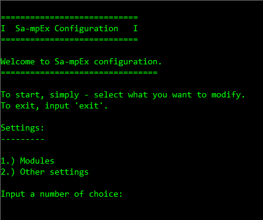
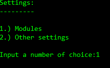
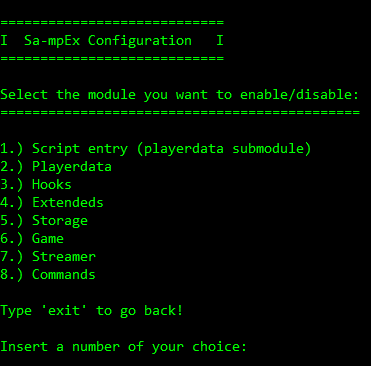
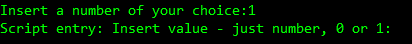
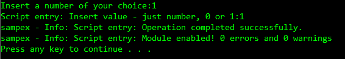

# SAMPEX_Config

**Sa-mpEx** module, submodule and gamemode configuration documentation.

## Quick start

- Below, I will present the *Sa-mpEx configuration*.

### 1. Launching settings

- To launch (open) Sa-mpEx configuration, we need to open *SAMPEX.bat* file located in main branch, or eventually - if you downloaded Sa-mpEx_Includes, in your ``includes`` folder.

- It should look like this:



- So, excellent - you opened configuration **main menu**.

### 2. Main menu

- So, on main menu, we can select what class we want to modify, for example: submodule settings, module imports etc.

- For this presentation, I will open *module configuration*.

- To open module config, we insert ``1``:



- After we submitted the query (``1``), it should display this:



### 3. Configuration

- To config specific module, we need to insert its moduleconfig id.

- For this presentation, I will modify ``scriptentry``, SAMPEX_Playerdata *submodule* needed to set up stats for MySQL connection and BCrypt hashing!

- Submodule **scriptentry** was ``OFF``, so - I will turn it ``ON`` (enable it) so Sa-mpEx can read data from cached *.inc* files in SAMPEX_Config which are modified after you interact with this Sa-mpEx config app.

- So:



- ...and press *ENTER*:



- Done! We successfully enabled ``scriptentry`` submodule, now we can use its functions in our gamemode!

## Note ( tip )

### In-app configuration

- Use ``0`` which means ``false`` or ``1`` which means ``true`` to disable/enable specific module, submodule or a setting. Note that you can only modify settings and modules that are listed in application! If you try to input invalid config id, app will warn you and display an error saying:

```pawn
sampex - Error: Wrong moduleconfig choice id.
sampex - Info: 1 error found
```

### Linux user?

- Sadly, if you're LinuxOS user, you can't modify Sa-mpEx this way!

- But, don't worry. Sa-mpEx can be still modified using regular *.cfg* file in linux-config directory located in main branch of this repository!

- To modify, you simply change values of defines to ``1`` or ``0`` - nothing else!

***1. Configuration***

```pawn
#define sampex_include_scriptentry            0
#define sampex_playerdata_included            0

#define sampex_hooks_included                 0
#define sampex_extendeds_included             0
#define sampex_storage_included               0
#define sampex_game_included                  0
#define sampex_streamer_included              0
#define sampex_commands_included              0
```
- So, where are we? In ``SAMPEX.cfg``, here we modify Sa-mpEx!

- For this example, we will again enable ``scriptentry`` submodule which is currently ``OFF`` as we can see:

```pawn
#define sampex_include_scriptentry            0
```

- To enable it, simply change the zero (``0``) value to ``1``.

***2. Importing settings***

- To import our settings, instead of:

```pawn
#include <SAMPEX.cfg>
```

- ... we import it this way:

```pawn
#include <linux-config\SAMPEX.cfg>
```